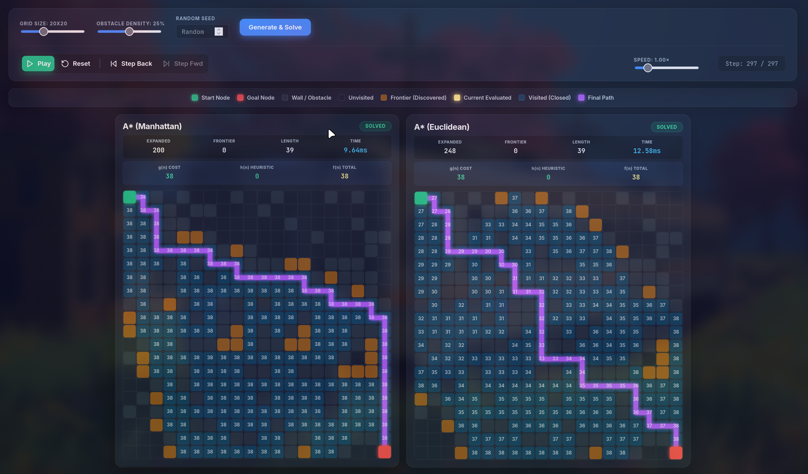

# A* Comparative Visualizer

> An interactive web application that runs **four pathfinding algorithms simultaneously** and lets you watch them explore a maze step by step — comparing heuristics side-by-side in real time.



🔗 **Live Demo:** [a-star-comparative-visualizer.vercel.app](https://a-star-comparative-visualizer.vercel.app)

---

## What is this?

The A* algorithm finds the shortest path between two points on a grid. Its efficiency depends heavily on the **heuristic function** used to estimate the remaining distance to the goal. This app visualizes and compares four variants simultaneously:

| Panel | Algorithm | Heuristic h(n) | Characteristic |
|-------|-----------|----------------|----------------|
| 1 | **A\* Manhattan** | `|Δrow| + |Δcol|` | Best for 4-directional grids |
| 2 | **A\* Euclidean** | `√(Δrow² + Δcol²)` | Straight-line distance |
| 3 | **A\* Chebyshev** | `max(|Δrow|, |Δcol|)` | Best for 8-directional movement |
| 4 | **Dijkstra** | `h(n) = 0` | Explores uniformly, no heuristic |

---

## Features

- ⚡ **Side-by-side comparison** of 4 algorithms on the same maze
- 🎬 **Step-by-step animation** with Play / Pause / Step Forward / Step Back controls
- 🎛️ **Configurable** grid size (10×10 to 40×40), obstacle density, and random seed
- 📊 **Live stats** per algorithm: nodes expanded, frontier size, g(n), h(n), f(n), execution time, path length
- 🌐 **Canvas rendering** with DPI-aware drawing, glowing path lines, and rounded cells
- 🔢 **f(n) cost overlay** displayed on each visited cell

---

## Tech Stack

| Layer | Technology |
|-------|-----------|
| **Frontend** | React 18 + TypeScript + Vite |
| **Rendering** | HTML5 Canvas API |
| **Backend** | Python 3.12 + Flask + Gunicorn |
| **Deployment** | Vercel (frontend) + Render (backend via Docker) |

---

## Project Structure

```
A_Star_Comparative_Visualizer/
├── backend/
│   ├── app.py              # Flask API (health, generate, solve)
│   ├── maze.py             # Random maze generator
│   ├── algorithms/
│   │   └── astar.py        # A* with pluggable heuristics
│   ├── requirements.txt
│   └── Dockerfile
├── frontend/
│   ├── src/
│   │   ├── App.tsx                        # Main app + controls
│   │   ├── components/GridVisualizer.tsx  # Canvas grid renderer
│   │   ├── hooks/useAnimationEngine.ts    # Playback engine
│   │   └── index.css                      # Dark glassmorphism theme
│   ├── vercel.json
│   ├── nginx.conf
│   └── Dockerfile
├── assets/
│   └── preview.jpg
├── render.yaml             # Render deployment config
└── docker-compose.yml      # Local Docker setup
```

---

## Running Locally

### Prerequisites
- Python 3.10+
- Node.js 18+

### Backend
```bash
cd backend
python3 -m venv venv
source venv/bin/activate
pip install -r requirements.txt
python app.py
# Runs on http://localhost:5000
```

### Frontend
```bash
cd frontend
npm install
npm run dev
# Runs on http://localhost:5173
```

### With Docker Compose
```bash
docker-compose up --build
# Backend → http://localhost:5000
# Frontend → http://localhost:5173
```

---

## API Reference

| Endpoint | Method | Description |
|----------|--------|-------------|
| `/health` | GET | Health check — returns `{"status": "healthy"}` |
| `/generate` | POST | Generate a random maze grid |
| `/solve` | POST | Run all 4 algorithms and return traces |

### `/generate` Request
```json
{
  "rows": 20,
  "cols": 20,
  "density": 0.25,
  "seed": 42
}
```

### `/solve` Request
```json
{
  "grid": [[0,1,0,...], ...],
  "start": [0, 0],
  "goal": [19, 19]
}
```

---

## Deployment

| Service | Platform | Config |
|---------|----------|--------|
| Backend | [Render](https://render.com) | `render.yaml` + `backend/Dockerfile` |
| Frontend | [Vercel](https://vercel.com) | `frontend/vercel.json` |

Set `VITE_API_URL` in Vercel environment variables pointing to your Render backend URL.

---

## How A* Works

A* evaluates nodes using:

$$f(n) = g(n) + h(n)$$

- **g(n)** — actual cost from start to node n  
- **h(n)** — estimated cost from n to goal (heuristic)  
- **f(n)** — total estimated cost through n  

The algorithm always expands the node with the lowest f(n) first. A better heuristic means fewer nodes explored and faster pathfinding — which is exactly what this visualizer demonstrates.

---

## License

MIT
